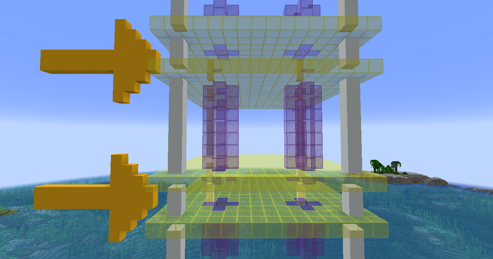

# Floor Gaps and Connector Tubes Code <!-- omit in toc -->

## Table of Contents <!-- omit in toc -->

- [1. Introduction](#1-introduction)
- [2. Definitions](#2-definitions)
- [3. Floor Gaps](#3-floor-gaps)
- [4. Connector Tubes](#4-connector-tubes)
- [5. Exemptions](#5-exemptions)
- [6. Summary](#6-summary)

## 1. Introduction

This building code outlines the requirements for floor gaps and connector tubes within buildings in Samland. The code aims to ensure easy maintenance and modification of electrical and plumbing installations while promoting safety and accessibility.

## 2. Definitions

In this code:

- **Floor**: A horizontal surface within a building where people walk or place objects.
- **Ceiling**: The overhead surface located below the floor of the level above.

## 3. Floor Gaps

Floor gaps are open spaces between floors and the ceilings below them. They provide access for maintenance, modifications, and installations of electrical and plumbing systems.

- Floor gaps must have a minimum distance of **2 meters** between each floor and the ceiling below.
- Floor gaps should be present in all buildings, unless otherwise permitted.

*Image: Illustration of Floor Gaps*

## 4. Connector Tubes

Connector tubes are hollow structures resembling pillars or columns, with a minimum width of one meter. They serve as vertical conduits connecting all floor gaps to the area below the building.

- Connector tubes facilitate the routing of electrical and plumbing installations, ensuring efficient distribution and easy access for maintenance and modifications.

*Image: Illustration of Connector Tubes*

## 5. Exemptions

Buildings that do not wish to incorporate floor gaps or connector tubes must obtain specific permits from the appropriate regulatory authorities. The permits will outline alternative methods or solutions that meet the necessary safety, maintenance, and accessibility requirements.

## 6. Summary

This building code mandates the presence of floor gaps and connector tubes in Samland buildings. Floor gaps provide easy access for electrical and plumbing maintenance, while connector tubes ensure efficient routing and accessibility. Exemptions can be granted with appropriate permits. This code contributes to a safe, adaptable, and well-maintained built environment in Samland.
